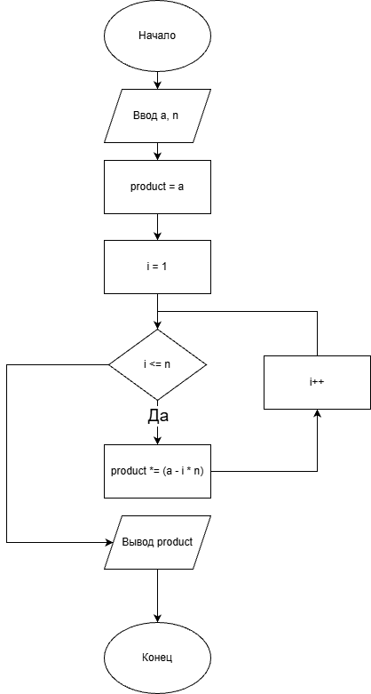
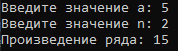

# Домашняя работа 8
## Условие задачи

## Конкретный пример
Если a = 5, n = 2, Тогда произведение ряда: 5 * (5-2) * (5 - 4)= 5 * 3 * 1 = 15
### Алгоритм
1. **Начало**
2. Объявление переменных:
   - int a, n
   - long long product
3. Инициализация
   - product = a;
4. Ввод данных:
   - a
   - n
5. Цикл for:
   - for (int i = 1; i <= n; i++) 
    product = product * (a - i * n);

6. Вывод результата:
   - product
7. **Конец**
### Блок-схема

[Ссылка](https://viewer.diagrams.net/?tags=%7B%7D&lightbox=1&highlight=0000ff&edit=_blank&layers=1&nav=1&title=8_1.png&dark=auto#R%3Cmxfile%3E%3Cdiagram%20name%3D%22%D0%A1%D1%82%D1%80%D0%B0%D0%BD%D0%B8%D1%86%D0%B0%20%E2%80%94%201%22%20id%3D%22YBHr6eNzSqN0wLppfZb6%22%3E5Vpdj6M2FP01SO1KGYGJIXlMJtOt1F1ppXlo99EJDnhlMHWcTbK%2FvjY2X4HMQAZmkBpFBF9fm8vxOdfGxHIf4%2FNnjtLoKwswtYAdnC13YwHgzIEnf5Tloi3%2BEmpDyElgnErDM%2FmFjdE21iMJ8KHmKBijgqR1444lCd6Jmg1xzk51tz2j9aumKMQNw%2FMO0ab1bxKISFsXwC%2Ftf2ISRvmVHW%2Bpa2KUO5s7OUQoYKeKyX2y3EfOmNBn8fkRUwVejotu98eN2iIwjhPRpUEM9183n%2F8i%2Bx%2BEeoDNhNiK2Vz3goMGCmW3xnRgR77DL%2FQFjJ%2B45OCpbp9NkXERsZAliD6V1jVnxyTAKkJblkqfL4yl0uhI4w8sxMUQAx0Fk6ZIxNTUGkogHmLxQmyu9vuJ6NHEVoyApC5mMRb8Ih04pkiQn3UwkOFQWPiVMMsTg3QP1MFtkCvgUSpJrkA6RUTg5xRl6J%2BkztogqN6aBHO5Uce1bUmXhZ%2Bfy%2BM6Oz6ZRpgLfK5E0EQkqrB7Yah8KpXg5PQ2vbhzeyTQvAGp6k6YqnBSVHW7UFWmtlSdSi9EKaYs5CiWd5xiTmQYmF%2FXfSsrXmP3npxxPi%2B0sx14VChHJgOUEw3hmd3796gy6zobh6JUizs3KhUQmfJniJIwsdyVAiWJZIy6SdnYC83ve19RKTrT9RoY%2FarjXI24BeTI2ol0RbHCLtke0kqQctR1nPXYG%2BY70oHXIx1c8ml9rPSwGDA9wAmnB39S6QF2SQ%2B956%2F%2FgaJTzoLjTjRUq%2FpUmp6keBdjiTdf7Q%2BiXn%2FC6l1OSr3%2BbZDvVy%2BRRU1j572ICfzRiAkGJOZywsR0nMZAfiQzHbPuNI%2F1aJsjZjfhf3HgrsD%2BgraY1gEyCXuzkx1mC9I8la9MRUyCQI8FPpBfJhQ1GikjicjuHK4tuDHzR75WXd58NJubx7Gu6miF3DSZ2Q%2Bu%2FNweBtPdNxVrxYXt9wdJiOtxKq76hofbIXP5h0hGRskv%2F5j2WeG7KjzAvLg5Vys3F1PqKDUwuNSypivO0aXiYNjZpIBhDnDrSXTuXO0fveLv1f3liY7gRmu%2F%2FWpFuBo202p4Vi67THU8YvH2eLhjyyWb9PK1nF6jZVNgctcU2LbP4lxPgbCGpzveFAh76PmDdFpK83u17m06deaT0Clc1JUD3T66m3vtrYvL6xTc0N2rYcyX7ytgpxPr%2Buq2eAyzP2nB%2FiafveyZCiazSQX%2FfpeE71jFwtH2RnImD77QX2ffceCB4Ipwo8ED3AFXLNNKhfZAS5ZxUmEzWzn%2BQ31e869HfeQ0021y%2B9gNb7MZ7FiLdeuWcJHU3ilvjbYtBDrlrTe%2BKFtV0NMvzWCGrXcXfn1ekd2i%2BHD49XlnVgE0CVbq1bksJSzBdRDrqWrkvNN5CVYdAmjgbM1FlXGBL8A%2ByErNhb1WanZ76%2F4rteuOwFApVBbL%2Fyto9%2FJfH%2B7Tfw%3D%3D%3C%2Fdiagram%3E%3C%2Fmxfile%3E)

## 2. Реализация программы:

				    #include <stdio.h>
				    #define _CRT_SECURE_NO_DEPRECATE
				    #include <stdlib.h>
				    #include <locale.h>
				    #define _USE_MATH_DEFINES
				    #include <math.h>
				    
				int main() {
				    int a, n;
				    long long product;
				    
				    setlocale(LC_ALL, "RUS");
				    
				    // Ввод значений a и n
				    printf("Введите значение a: ");
				    scanf("%d", &a);
				    printf("Введите значение n: ");
				    scanf("%d", &n);
				    
				    // Инициализация первым элементом ряда
				    product = a;
				    
				    // Вычисление произведения ряда: a * (a - n) * (a - 2n) * ... * (a - n*n)
				    for (int i = 1; i <= n; i++) {
				        product = product * (a - i * n);
				    }
				    
				    // Вывод результата
				    printf("Произведение ряда: %lld\n", product);
				    
				    return 0;
				}
					   
## 3. Результаты работы программы

## 4. Информация о разработчике

Гусев Степан, бИЦ-251
