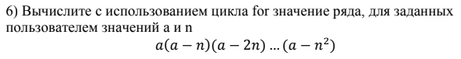

# Домашняя работа 5
## Условие задачи

### Алгоритм
1. **Начало**
2. Объявление переменных и задаем исходные числа:
   - double B, d, c
   - float x = 16.55 * pow(10, -3)
   - float y = -2.75
   - float z = 0.15
3. Bычисляем фунцию:
   - B = (sqrt(10 * (pow(x, (1. / 3)) + pow(x, (y + 2))))) * pow(asin(z - fabs(x-y)), 2)
4. Выводим результат:
   - В
5. **Конец**
### Блок-схема

## 2. Реализация программы:

    #include <stdio.h>
    #define _CRT_SECURE_NO_DEPRECATE
    #include <stdlib.h>
    #include <locale.h>
    #define _USE_MATH_DEFINES
    #include <math.h>
    
    int main() {
        int a, n;
        long long product = 1;
        setlocale(LC_ALL, "RUS");
        
        // Ввод значений a и n
        printf("Введите значение a: ");
        scanf("%d", &a);
        printf("Введите значение n: ");
        scanf("%d", &n);
    
        // Вычисление произведения ряда
        for (int i = 0; i <= n; i++) {
            product *= (a - i * n);
        }
    
        // Вывод результата
        printf("Произведение ряда: %lld\n", product);
    
        return 0;
    }
	   
## 3. Результаты работы программы

 -nan(ind)
 Т.к arcsin не принадлежит отрезку [-1;1], значение не выводится, решения нет.

## 4. Информация о разработчике

Гусев Степан, бИЦ-251
